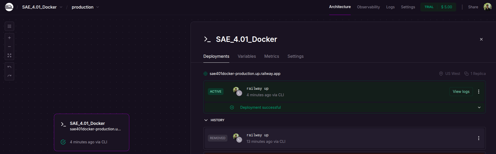
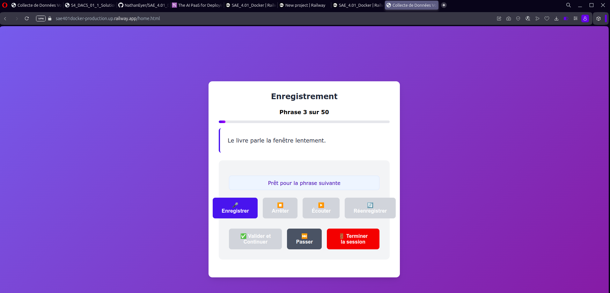

# SAE 4.01 - Application de Collecte Audio avec Déploiement via Docker

Une application web moderne et sécurisée pour la collecte d'enregistrements vocaux avec interface utilisateur intuitive et déploiement Docker.

## Aperçu du Projet

Cette application permet de collecter des enregistrements audio d'utilisateurs lisant des phrases prédéfinies, tout en garantissant l'anonymat et la confidentialité. Elle respecte toutes les exigences fonctionnelles et techniques spécifiées dans le cahier des charges.

### Fonctionnalités Principales

- **Interface moderne et responsive** avec design contemporain
- **Collecte anonyme** d'informations démographiques (âge, genre)
- **Consentement explicite** requis avant la collecte
- **Enregistrement audio** avec contrôles intuitifs
- **Configuration flexible** du nombre de phrases
- **Sauvegarde fiable** avec gestion des sessions
- **Sortie anticipée** avec préservation des données
- **Containerisation Docker** complète

##  Architecture

```
SAE_4.01_DOCKER/
├── backend/
│   ├── index.php             
│   └── sentences.php          
├── frontend/
│   ├── home.html             
│   └── script.js            
├── sentences/
│   └── sentences.txt         
├── recordings/               
├── sessions/                 
├── Dockerfile               
├── compose.yaml             
└── README.md               
```

##  Installation et Démarrage

### Prérequis

- Docker (version 20.10+)
- Docker Compose (version 2.0+)
- Navigateur moderne avec support WebRTC

### Installation Rapide

1. **Cloner le projet**
   ```bash
   git clone git@github.com:NathanEyer/SAE_4.01_Docker.git
   cd SAE_4.01_DOCKER
   ```

2. **Donner les permissions nécessaires (si pas effectif lors du clonage)**
   ```bash
   docker-compose up -d
   ```

4. **Accéder à l'application**
   ```
   http://localhost:8080/home.html
   ```

## Utilisation

### Étapes du Processus

1. **Page d'accueil** : Introduction et démarrage
2. **Informations démographiques** : Saisie âge, genre, consentement
3. **Configuration** : Choix du nombre de phrases (5-20)
4. **Enregistrement** : Lecture et enregistrement des phrases
5. **Finalisation** : Résumé et sauvegarde

### Interface d'Enregistrement

- **🎤 Enregistrer** : Démarrer l'enregistrement
- **⏹️ Arrêter** : Terminer l'enregistrement
- **▶️ Écouter** : Lecture de l'enregistrement
- **🔄 Réenregistrer** : Nouvel enregistrement
- **✅ Valider** : Sauvegarder et continuer
- **⏭️ Passer** : Ignorer la phrase actuelle
- **🚪 Terminer** : Fin anticipée de session

## Configuration

### Phrases Personnalisées

Éditez `sentences/sentences.txt` pour ajouter vos propres phrases :

```
Votre première phrase à enregistrer.
Votre deuxième phrase à enregistrer.
...
```

## Sécurité et Confidentialité

### Mesures de Protection

- **Anonymat garanti** : Aucune information personnellement identifiable
- **Consentement explicite** requis
- **Données chiffrées** en transit (HTTPS en production)
- **Accès restreint** aux dossiers sensibles
- **Headers de sécurité** configurés


### Endpoints Disponibles

- `GET /index.php?action=sentences` - Récupérer les phrases
- `POST /index.php` - Créer une session, sauvegarder enregistrement, finaliser session

### Codes de Retour

- `200` - Succès
- `400` - Requête invalide
- `500` - Erreur serveur

##  Dépannage

### Problèmes Courants

1. **Port 8080 déjà utilisé**
   ```bash
   # Changer le port dans compose.yaml
   ports:
     - "8081:80"
   ```

2. **Permissions des fichiers**
   ```bash
   sudo chown -R www-data:www-data recordings/ sessions/
   chmod -R 775 recordings/ sessions/
   ```

3. **Problème de microphone**
   - Vérifier les autorisations du navigateur
   - Utiliser HTTPS en production
   - Tester avec différents navigateurs

##  Déployement Cloud


